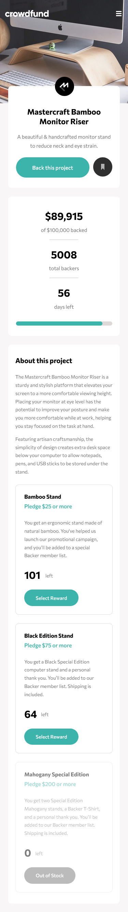
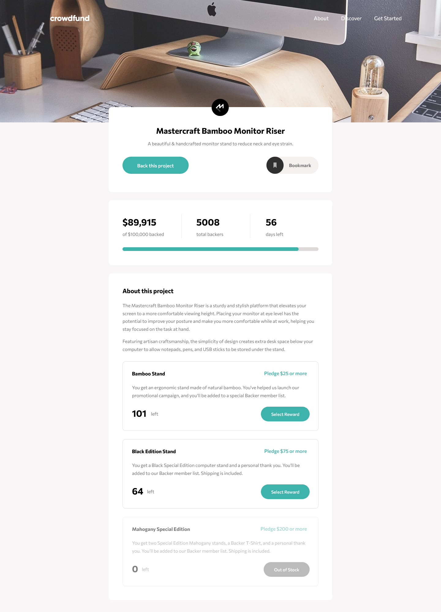

# Frontend Mentor - Crowdfunding product page solution

This is a solution to the [Crowdfunding product page challenge on Frontend Mentor](https://www.frontendmentor.io/challenges/crowdfunding-product-page-7uvcZe7ZR). Frontend Mentor challenges help you improve your coding skills by building realistic projects. 

## Table of contents

- [Overview](#overview)
  - [The challenge](#the-challenge)
  - [Screenshot](#screenshot)
  - [Links](#links)
- [My process](#my-process)
  - [Built with](#built-with)
  - [What I learned](#what-i-learned)
  - [Continued development](#continued-development)
  - [Useful resources](#useful-resources)
- [Author](#author)

## Overview

### The challenge

Users should be able to:

- View the optimal layout depending on their device's screen size
- See hover states for interactive elements
- Make a selection of which pledge to make
- See an updated progress bar and total money raised based on their pledge total after confirming a pledge
- See the number of total backers increment by one after confirming a pledge
- Toggle whether or not the product is bookmarked

### Screenshot




### Links

- Solution URL: [Add solution URL here](https:/)
- Live Site URL: [Add live site URL here](https://mauritzlm.github.io/crowdfunding-product-page/)

## My process

### Built with

- Semantic HTML5 markup
- CSS custom properties
- Flexbox
- CSS Grid
- Mobile-first workflow

### What I learned

I learned that a fieldset can be disabled. This disables all the descendants of that fieldset. - mdn
The radio input in the example below is disabled.

```html
<fieldset disabled>
  <div class="pledge-info">
            <div>
              <input type="radio" name="pledge" id="special-edition">
              <label class="bold" for="special-edition">
                Mahogany Special Edition <br>
                <span class="pledge-amount">Pledge $200 or more</span>
              </label>
            </div>
</fieldset>
```
1. A form can have multiple submit buttons that go to different URLs.
2. If one input field in a form is invalid the form wont submit. 

### Continued development

I want to continue learning about how to plan and structure a project, especially as I'm starting to take on more difficult projects. 

### Useful resources

- [multiple form submit buttons](https://css-tricks.com/separate-form-submit-buttons-go-different-urls/) - having multiple submit buttons in a form.
- [remove arrows from number inputs](https://www.w3schools.com/howto/howto_css_hide_arrow_number.asp) - how to remove number input arrows. 
- [building custom radio buttons](https://moderncss.dev/pure-css-custom-styled-radio-buttons/) - custom styled radio buttons article.

## Author

- Frontend Mentor - [@MauritzLM](https://www.frontendmentor.io/profile/MauritzLM)


